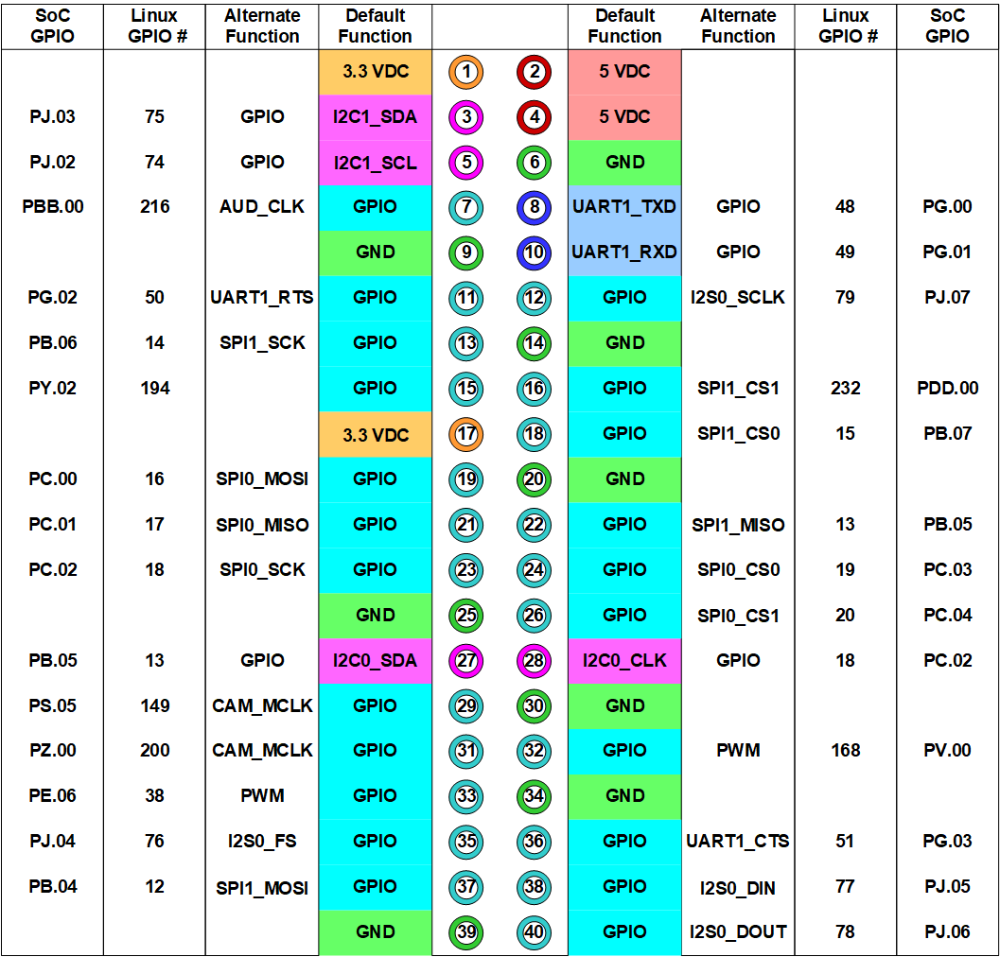
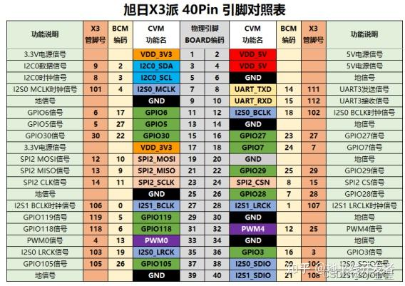

# Compatibility

The devices HATs for Raspberry Pi and Raspberry Pico are wired differently
and the pinout is not compatible even when using a Pico-to-Pi breakout board.

## Raspberry Pi HATs & modules

__TODO:__
 - confirm VCC is provided via pin 1 (could also be pin 17)
 - confirm GND is provided via pin 39 (could be any other ground pin)

compatibility according to https://www.waveshare.com/wiki/Main_Page#Display-e-Paper

There are multiple pinout variations, they can be classified as follows:

- 6 data pins
  - uni-directional SPI bus, with DC
  - bi-directional SPI bus, without DC
- 7 data pins
  - uni-directional SPI bus, with DC and PWR
- 11 data pins
  - uni-directional SPI bus, with I²C, DC and PWR
- 14 data pins
  - uni-directional SPI bus, with 4 SPI devices and DC

Here's a table of all relevant ePaper displays:

| device                       | resolution  | interface | EpdPinout_6v1  | EpdPinout_6v2  | EpdPinout_7v1  | EpdPinout_11v1 | EpdPinout_14v1 |
| ---------------------------- |:-----------:|:---------:|:--------------:|:--------------:|:--------------:|:--------------:|:--------------:|
| 1.54inch e-Paper             |  200 ×  200 | SPI       |        ✓       |        -       |        -       |        -       |        -       |
| 1.54inch e-Paper Module (B)  |  200 ×  200 | SPI       |        ✓       |        -       |        -       |        -       |        -       |
| 1.54inch e-Paper Module (C)  |  152 x  152 | SPI       |        ✓       |        -       |        -       |        -       |        -       |
| 2.13inch e-Paper HAT         |  250 ×  122 | SPI       |        ✓       |        -       |        -       |        -       |        -       |
| 2.13inch e-Paper HAT (B)     |  250 ×  122 | SPI       |        ✓       |        -       |        -       |        -       |        -       |
| 2.13inch e-Paper HAT (C)     |  250 ×  122 | SPI       |        ✓       |        -       |        -       |        -       |        -       |
| 2.13inch e-Paper HAT (D)     |  212 ×  104 | SPI       |        -       |       ✓        |        -       |        -       |        -       |
| 2.13inch Touch e-Paper HAT   |  250 ×  122 | SPI, I²C  |       (✓)      |        -       |        -       |         ✓      |        -       |
| 2.15inch e-Paper HAT+ (B)    |  296 ×  160 | SPI       |        -       |        -       |        ✓       |        -       |        -       |
| 2.15inch e-Paper HAT+ (G)    |  296 ×  160 | SPI       |        -       |        -       |        ✓       |        -       |        -       |
| 2.66inch e-Paper Module      |  296 ×  152 | SPI       |        ✓       |        -       |        -       |        -       |        -       |
| 2.66inch e-Paper Module (B)  |  296 ×  152 | SPI       |        ✓       |        -       |        -       |        -       |        -       |
| 2.7inch e-Paper HAT          |  264 ×  176 | SPI       |        ✓       |        -       |        -       |        -       |        -       |
| 2.7inch e-Paper HAT (B)      |  264 ×  176 | SPI       |        ✓       |        -       |        -       |        -       |        -       |
| 2.9inch e-Paper Module       |  296 ×  128 | SPI       |        ✓       |        -       |        -       |        -       |        -       |
| 2.9inch e-Paper Module (B)   |  296 ×  128 | SPI       |        ✓       |        -       |        -       |        -       |        -       |
| 2.9inch e-Paper Module (C)   |  296 ×  128 | SPI       |        ✓       |        -       |        -       |        -       |        -       |
| 2.9inch e-Paper HAT (D)      |  296 ×  128 | SPI       |        -       |        ✓       |        -       |        -       |        -       |
| 3.52inch e-Paper HAT (B)     |  360 ×  240 | SPI       |        ✓       |        -       |        -       |        -       |        -       |
| 3.7inch e-Paper HAT          |  480 ×  280 | SPI       |        ✓       |        -       |        -       |        -       |        -       |
| 4.01inch e-Paper HAT (F)     |  640 ×  400 | SPI       |        -       |        -       |        ✓       |        -       |        -       |
| 4.2inch e-Paper Module       |  400 ×  300 | SPI       |        ✓       |        -       |        -       |        -       |        -       |
| 4.2inch e-Paper Module (B)   |  400 ×  300 | SPI       |        ✓       |        -       |        -       |        -       |        -       |
| 4.2inch e-Paper Module (C)   |  400 ×  300 | SPI       |        ✓       |        -       |        -       |        -       |        -       |
| 4.2inch e-Paper Module (G)   |  400 ×  300 | SPI       |        ✓       |        -       |        -       |        -       |        -       |
| 4.3inch e-Paper UART         |  800 x  600 | UART      |        -       |        -       |        -       |        -       |        -       |
| 5.65inch e-Paper Module (F)  |  600 ×  448 | SPI       |        ✓       |        -       |        -       |        -       |        -       |
| 5.83inch e-Paper HAT         |  648 ×  480 | SPI       |        -       |        -       |        ✓       |        -       |        -       |
| 5.83inch e-Paper HAT (B)     |  648 ×  480 | SPI       |        -       |        -       |        ✓       |        -       |        -       |
| 5.83inch e-Paper HAT (C)     |  648 ×  480 | SPI       |        -       |        -       |        ✓       |        -       |        -       |
| 6inch e-Paper HAT            |  800 ×  600 | SPI       |        -       |        ✓       |        -       |        -       |        -       |
| 6inch HD e-Paper HAT         | 1448 × 1072 | SPI       |        -       |        ✓       |        -       |        -       |        -       |
| 7.5inch e-Paper HAT          |  800 ×  480 | SPI       |        -       |        -       |        ✓       |        -       |        -       |
| 7.5inch e-Paper HAT (B)      |  800 ×  480 | SPI       |        -       |        -       |        ✓       |        -       |        -       |
| 7.5inch e-Paper HAT (C)      |  640 x  384 | SPI       |        ✓       |        -       |        -       |        -       |        -       |
| 7.5inch HD e-Paper HAT       |  880 x  528 | SPI       |        ✓       |        -       |        -       |        -       |        -       |
| 7.5inch HD e-Paper HAT (B)   |  880 x  528 | SPI       |        ✓       |        -       |        -       |        -       |        -       |
| 7.5inch e-Paper (G)          |  800 ×  480 | SPI       |        ✓       |        -       |        -       |        -       |        -       |
| 7.8inch e-Paper HAT          | 1872 × 1404 | SPI       |        -       |        ✓       |        -       |        -       |        -       |
| 9.7inch e-Paper HAT          | 1200 ×  825 | SPI       |        -       |        -       |        ✓       |        -       |        -       |
| 10.3inch e-Paper HAT         | 1872 x 1404 | SPI       |        -       |        ✓       |        -       |        -       |        -       |
| 10.3inch e-Paper HAT (D)     | 1872 × 1404 | SPI       |        -       |        ✓       |        -       |        -       |        -       |
| 10.3inch e-Paper HAT (G)     | 1872 x 1404 | SPI       |        -       |        ✓       |        -       |        -       |        -       |
| 12.48inch e-Paper Module     | 1304 x  984 | SPI (x4)  |        -       |        -       |        -       |        -       |        ✓       |
| 12.48inch e-Paper Module (B) | 1304 x  984 | SPI (x4)  |        -       |        -       |        -       |        -       |        ✓       |
| 13.3inch e-Paper HAT         | 1600 × 1200 | SPI (x4)  |        -       |        -       |        -       |        -       |        ✓       |
| 13.3inch e-Paper HAT (B)     |  960 ×  680 | SPI (x4)  |        -       |        -       |        -       |        -       |        ✓       |
| 13.3inch e-Paper HAT (K)     |  960 ×  680 | SPI (x4)  |        -       |        -       |        -       |        -       |        ✓       |
| e-Paper Driver HAT           |      -      | SPI       |        -       |        -       |        ✓       |        -       |        -       |

### logical pinout

This configuration is used by everything except the 4.3", 12.48" and 13.3"
e-Paper displays:

| pin | GPIO | direction | purpose                        | label   | feature pins   |
| --- | ---- | --------- | ------------------------------ | ------- | -------------- |
|  1  |      |           | supply voltage (3.3V)          | VCC     |                |
|  3  | GP03 | output    | I²C SDA                        | SDA     | 11v1           |
|  5  | GP05 | output    | I²C SCL                        | SCL     | 11v1           |
| 11  | GP17 | output    | reset                          | RST     |                |
| 12  | GP18 | output    | power down                     | PWR     |                |
| 13  | GP27 | output    | interrupt                      | INT     | 11v1           |
| 15  | GP22 | output    | touch reset                    | TRST    | 11v1           |
| 18  | GP24 | input     | busy signal                    | BUSY    |                |
| 19  | GP10 | output    | SPI0 data in (MOSI)            | DIN     |                |
| 21  | GP09 | output    | SPI0 data out (MISO)           | DOUT    | 6v2            |
| 22  | GP25 | output    | data/command select            | DC      | 6v1, 7v1, 11v1 |
| 23  | GP11 | output    | SPI0 clock (SCK)               | CLK     |                |
| 24  | GP8  | output    | SPI0 chip select #0 (SPI0_CS0) | CS      |                |
| 39  |      |           | ground                         | GND     |                |

This configuration is used by the 12.48" and 13.3" e-Paper displays:

| pin | GPIO | direction | purpose                        | label   |
| --- | ---- | --------- | ------------------------------ | ------- |
|  1  |      |           | supply voltage (3.3V)          | VCC     |
| 11  | GP17 | output    | subdisplay #2 (upper right)    | CS_M2   |
| 12  | GP18 | output    | subdisplay #1 (upper left)     | CS_S2   |
| 13  | GP27 | input     | busy signal #2 (upper right)   | BUSY_M2 |
| 15  | GP22 | output    | data/command select 2          | DC2     |
| 16  | GP23 | output    | reset 2                        | RST2    |
| 18  | GP24 | input     | busy signal #1 (upper left)    | BUSY_S2 |
| 19  | GP10 | output    | SPI0 data in (MOSI)            | DIN     |
| 23  | GP11 | output    | SPI0 clock (SCK)               | CLK     |
| 24  | GP08 | output    | subdisplay #3 (lower left)     | CS_M1   |
| 26  | GP07 | output    | subdisplay #4 (lower left)     | CS_S1   |
| 29  | GP05 | input     | busy signal #3 (lower left)    | BUSY_M1 |
| 31  | GP06 | output    | reset 1                        | RST1    |
| 33  | GP13 | output    | data/command select 1          | DC1     |
| 35  | GP19 | input     | busy signal #4 (lower right)   | BUSY_S1 |
| 39  |      |           | ground                         | GND     |

_These displays split the screen into 4 subscreens and use a separate SPI
devices to control each subdisplay. The pinout is incompatible with
everything else._

### physical pinout (40 pin GPIO header)

This configuration is used by everything except the 4.3", 12.48" and 13.3"
e-Paper displays:

```
       +-------+
 VCC   |  1  2 |
 SDA   |  3  4 |
 SCL   |  5  6 |
       |  7  8 |
       |  9 10 |
 RST   | 11 12 | PWR
 INT   | 13 14 |
 TRST  | 15 16 |
       | 17 18 | BUSY
 DIN    ┐19 20 |
 DOUT   ┘21 22 | DC
 CLK   | 23 24 | CS
       | 25 26 |
       | 27 28 |
       | 29 30 |
       | 31 32 |
       | 33 34 |
       | 35 36 |
       | 37 38 |
 GND   | 39 40 |
       +-------+
   board edge ->
```

This configuration is used by the 12.48" and 13.3" e-Paper displays.

```
         +-------+
 3V3     |  1  2 | 5V
         |  3  4 | 5V
         |  5  6 | GND
         |  7  8 |
 GND     |  9 10 |
 CS_M2   | 11 12 | CS_S2
 BUSY_M2 | 13 14 | GND
 DC2     | 15 16 | RST2
 3V3     | 17 18 | BUSY_S2
 DIN      ┐19 20 | GND
          ┘21 22 |
 CLK     | 23 24 | CS_M1
 GND     | 25 26 | CS_S1
         | 27 28 |
 BUSY_M1 | 29 30 | GND
 RST1    | 31 32 |
 DC1     | 33 34 | GND
 BUSY_S1 | 35 36 |
         | 37 38 |
 GND     | 39 40 |
         +-------+
     board edge ->
```

## Raspberry Pico HATs & modules

Please note:
- There is no dedicated 'power' pin. The reset pin is used to wake up,
  suspend and reset the display.
- Board power is provided via pin 36 `3V3(OUT)` or pin 39 `VSYS` depending
  on how the board is jumpered.
- Ground is commoned to all 'GND' pins.

Documentation:

- [Waveshare Pico e-Paper 2.13"](https://www.waveshare.com/wiki/Pico-ePaper-2.13)
- [Waveshare Pico e-Paper 2.13" (B)](https://www.waveshare.com/wiki/Pico-ePaper-2.13-B)
- [Waveshare Pico e-Paper 2.13" (D)](https://www.waveshare.com/wiki/Pico-ePaper-2.13-D)
- [Waveshare Pico e-Paper 2.66"](https://www.waveshare.com/wiki/Pico-ePaper-2.66)
- [Waveshare Pico e-Paper 2.66" (B)](https://www.waveshare.com/wiki/Pico-ePaper-2.66-B)
- [Waveshare Pico e-Paper 2.7"](https://www.waveshare.com/wiki/Pico-ePaper-2.7)
- [Waveshare Pico e-Paper 2.9"](https://www.waveshare.com/wiki/Pico-ePaper-2.9)
  - ✓ [Pico_ePaper-2.9.py](https://github.com/waveshareteam/Pico_ePaper_Code/blob/main/python/Pico_ePaper-2.9.py)
  - ✗ [Pico_ePaper-2.9-B.py](https://github.com/waveshareteam/Pico_ePaper_Code/blob/main/python/Pico_ePaper-2.9-B.py)
  - ✓ [Pico_ePaper-2.9-B_V4.py](https://github.com/waveshareteam/Pico_ePaper_Code/blob/main/python/Pico_ePaper-2.9-B_V4.py)
  - ✗ [Pico_ePaper-2.9-C.py](https://github.com/waveshareteam/Pico_ePaper_Code/blob/main/python/Pico_ePaper-2.9-C.py)
  - ✗ [Pico_ePaper-2.9_D.py](https://github.com/waveshareteam/Pico_ePaper_Code/blob/main/python/Pico_ePaper-2.9_D.py)
- [Waveshare Pico e-Paper 2.9" (B)](https://www.waveshare.com/wiki/Pico-ePaper-2.9-B)
- [Waveshare Pico e-Paper 2.9" (D)](https://www.waveshare.com/wiki/Pico-ePaper-2.9-D)
- [Waveshare Pico e-Paper 2.9" CapTouch](https://www.waveshare.com/wiki/Pico-CapTouch-ePaper-2.9)
- [Waveshare Pico e-Paper 3.7"](https://www.waveshare.com/wiki/Pico-ePaper-3.7)
- [Waveshare Pico e-Paper 4.2" (B)](https://www.waveshare.com/wiki/Pico-ePaper-4.2-B)
- [Waveshare Pico e-Paper 5.65"](https://www.waveshare.com/wiki/Pico-ePaper-5.65)
- [Waveshare Pico e-Paper 5.83"](https://www.waveshare.com/wiki/Pico-ePaper-5.83)
- [Waveshare Pico e-Paper 5.83" (B)](https://www.waveshare.com/wiki/Pico-ePaper-5.83-B)
- [Waveshare Pico e-Paper 7.5"](https://www.waveshare.com/wiki/Pico-ePaper-7.5)
- [Waveshare Pico e-Paper 7.5" (B)](https://www.waveshare.com/wiki/Pico-ePaper-7.5-B)

| device                       | resolution  | interface | colors        | EpdPinout_6v3  | EpdPinout_8v3  | EpdPinout_10v3 | extras                   |
| ---------------------------- |:-----------:|:---------:|:-------------:|:--------------:|:--------------:|:--------------:| ------------------------ |
| Pico ePaper 2.13"            |  250 x  128 | SPI       | b/w           |        ✓       |        -       |        -       |                          |
| Pico ePaper 2.13" V3         |  250 x  122 | SPI       | b/w           |        ✓       |        -       |        -       |                          |
| Pico ePaper 2.13" V4         |  250 x  122 | SPI       | b/w           |        ✓       |        -       |        -       | V3 with fast refresh     |
| Pico ePaper 2.13" (B)        |  212 x  104 | SPI       | b/r/w         |        ✓       |        -       |        -       |                          |
| Pico ePaper 2.13" (B) V3     |  212 x  104 | SPI       | b/r/w         |        ✓       |        -       |        -       |                          |
| Pico ePaper 2.13" (B) V4     |  250 x  122 | SPI       | b/r/w         |        ✓       |        -       |        -       |                          |
| Pico ePaper 2.13" (C)        |  212 x  104 | SPI       | b/y/w         |        ✓       |        -       |        -       |                          |
| Pico ePaper 2.13" (D)        |  212 x  104 | SPI       | b/w           |        ✓       |        -       |        -       |                          |
| Pico ePaper 2.66"            |  296 x  152 | SPI       | b/w           |        ✓       |        -       |        -       |                          |
| Pico ePaper 2.66" (B)        |  296 x  152 | SPI       | b/r/w         |        ✓       |        -       |        -       |                          |
| Pico ePaper 2.7"             |  264 x  176 | SPI       | b/d/l/w       |        ✓       |        -       |        -       |                          |
| Pico ePaper 2.7" V2          |  264 x  176 | SPI       | b/d/l/w       |        ✓       |        -       |        -       | local & quick refresh    |
| Pico ePaper 2.9"             |  296 x  128 | SPI, I²C  | b/d/l/w       |       (✓)      |        -       |        ✓ (?)   | I²C is not documented    |
| Pico ePaper 2.9" (B)         |  296 x  128 | SPI       | b/r/w         |        ✓       |        -       |        -       |                          |
| Pico ePaper 2.9" (B) V4      |  296 x  128 | SPI       | b/r/w         |        ✓       |        -       |        -       |                          |
| Pico ePaper 2.9" (C)         |  296 x  128 | SPI       | b/y/w (?)     |        ✓       |        -       |        -       | Pico_ePaper-2.9-C.py     |
| Pico ePaper 2.9" (D)         |  296 x  128 | SPI       | b/w           |        ✓       |        -       |        -       |                          |
| Pico ePaper 3.7"             |  280 x  480 | SPI       | b/w           |        ✓       |        -       |        -       |                          |
| Pico ePaper 4.2"             |  400 x  300 | SPI       | b/d/l/w       |        ✓       |        -       |        -       |                          |
| Pico ePaper 4.2" V2          |  400 x  300 | SPI       | b/d/l/w       |        ✓       |        -       |        -       |                          |
| Pico ePaper 4.2" (B) old     |  400 x  300 | SPI       | b/r/w         |        ✓       |        -       |        -       | Pico_ePaper-4.2-B_old.py |
| Pico ePaper 4.2" (B)         |  400 x  300 | SPI       | b/r/w         |       (✓)      |        ✓       |        -       | 2 buttons                |
| Pico ePaper 5.65" f          |  600 x  448 | SPI       | b/g/b/r/y/o/w |        ✓       |        -       |        -       |                          |
| Pico ePaper 5.83"            |  648 x  480 | SPI       | b/w           |        ✓       |        -       |        -       |                          |
| Pico ePaper 5.83" (B)        |  648 x  480 | SPI       | b/r/w         |        ✓       |        -       |        -       |                          |
| Pico ePaper 7.5"             |  800 x  480 | SPI       | b/w           |        ✓       |        -       |        -       |                          |
| Pico ePaper 7.5" old         |  800 x  480 | SPI       | b/w           |        ✓       |        -       |        -       |                          |
| Pico ePaper 7.5" (B)         |  800 x  480 | SPI       | b/w           |       (✓)      |        ✓ (?)   |        -       | 2 buttons                |
| Pico ePaper 7.5" (B) old     |  800 x  480 | SPI       | b/w           |        ✓       |        -       |        -       |                          |

- b/w: black (0b0), white (0b1)
- b/r/w: black (0b00), red (0b10), white (0b11)
- b/d/l/g: black (0b00), dark grey (0b01), light grey (0b10), white (0b11)
- b/g/n/r/y/o/w: black (0b0000), green (0b0010), blue (0b0011), red (0b0100), yellow (0b0101), orange (0b0110), white (0b0001)

### logical pinout

for all except Pico e-Paper 4.2", Pico e-Paper 7.5" and Pico CapTouch ePaper-2.9

| pin | GPIO | direction | purpose                        | label |
|-----|------|-----------|--------------------------------|-------|
| GND |      |           | ground                         | GND   |
| 11  | GP8  | output    | data/command select            | DC    |
| 12  | GP9  | output    | SPI1 chip select (SPI1_CSn)    | CS    |
| 14  | GP10 | output    | SPI clock (SPI1_SCK)           | CLK   |
| 15  | GP11 | output    | SPI data in (SPI1_TX)          | DIN   |
| 16  | GP12 | output    | reset                          | RST   |
| 17  | GP13 | input     | busy signal                    | BUSY  |
| 37  |      |           | supply voltage (3.3V)          | VCC   |
| 39  |      |           | supply voltage (VSYS)          | VCC   |

for Pico e-Paper 4.2" and Pico e-Paper 7.5"

| pin | GPIO | direction | purpose                        | label |
|-----|------|-----------|--------------------------------|-------|
| GND |      |           | ground                         | GND   |
| 11  | GP8  | output    | data/command select            | DC    |
| 12  | GP9  | output    | SPI1 chip select (SPI1_CSn)    | CS    |
| 14  | GP10 | output    | SPI clock (SPI1_SCK)           | CLK   |
| 15  | GP11 | output    | SPI data in (SPI1_TX)          | DIN   |
| 16  | GP12 | output    | reset                          | RST   |
| 17  | GP13 | input     | busy signal                    | BUSY  |
| 20  | GP15 | input     | user button #0                 | KEY0  |
| 22  | GP17 | input     | user button #1                 | KEY1  |
| 37  |      |           | supply voltage (3.3V)          | VCC   |
| 39  |      |           | supply voltage (VSYS)          | VCC   |

for [Pico-CapTouch-ePaper-2.9](https://www.waveshare.com/wiki/Pico-CapTouch-ePaper-2.9)

| pin | GPIO | direction | purpose                        | label |
|-----|------|-----------|--------------------------------|-------|
| GND |      |           | ground                         | GND   |
| 11  | GP8  | output    | data/command select            | DC    |
| 12  | GP9  | output    | SPI1 chip select (SPI1_CSn)    | CS    |
| 14  | GP10 | output    | SPI clock (SPI1_SCK)           | CLK   |
| 15  | GP11 | output    | SPI data in (SPI1_TX)          | DIN   |
| 16  | GP12 | output    | reset                          | RST   |
| 17  | GP13 | input     | busy signal                    | BUSY  |
| 21  | GP16 | output    | reset pin of touch panel       | TRST  |
| 22  | GP17 | input     | interrupt pin of Touch panel   | INT   |
|  9  | GP6  | output    | I²C data pin of touch panel    | SDA   |
| 10  | GP7  | output    | I²C clock pin of touch panel   | SCL   |
| 37  |      |           | supply voltage (3.3V)          | VCC   |
| 39  |      |           | supply voltage (VSYS)          | VCC   |

### physical pinout

This configuration is used by everything except the 2.9" (B), 4.2" (B) and
4.2" (B) old e-Paper displays:

```
            +---+
      +--+  |USB|  +--+
      | 1|  +---+  |40|
      | 2|         |39| VCC (VSYS)
  GND | 3|         |38| GND
      | 4|         |37| VCC (3V3)
      | 5|         |36|
      | 6|         |35|
      | 7|         |34|
  GND | 8|         |33| GND
      | 9|         |32|
      |10|         |31|
   DC |11|         |30|
   CS |12|         |29|
  GND |13|         |28| GND
      |14|         |27|
      |15|         |26|
  RST |16|         |25|
  BSY |17|         |24|
  GND |18|         |23| GND
      |19|         |22|
      |20|         |21|
      +--+         +--+
```

This configuration is used by the 2.9" (B), 4.2" (B) and 4.2" (B) old
e-Paper displays.

```
            +---+
      +--+  |USB|  +--+
      | 1|  +---+  |40|
      | 2|         |39| VCC (VSYS)
  GND | 3|         |38| GND
      | 4|         |37| VCC (3V3)
      | 5|         |36|
      | 6|         |35|
      | 7|         |34|
  GND | 8|         |33| GND
      | 9|         |32|
      |10|         |31|
   DC |11|         |30|
   CS |12|         |29|
  GND |13|         |28| GND
  CLK |14|         |27|
  DIN |15|         |26|
  RST |16|         |25|
  BSY |17|         |24|
  GND |18|         |23| GND
      |19|         |22|
      |20|         |21|
      +--+         +--+
```

for [Pico-CapTouch-ePaper-2.9](https://www.waveshare.com/wiki/Pico-CapTouch-ePaper-2.9)

```
            +---+
      +--+  |USB|  +--+
      | 1|  +---+  |40|
      | 2|         |39| VCC (VSYS)
  GND | 3|         |38| GND
      | 4|         |37| VCC (3V3)
      | 5|         |36|
      | 6|         |35|
      | 7|         |34|
  GND | 8|         |33| GND
  SDA | 9|         |32|
  SCL |10|         |31|
   DC |11|         |30|
   CS |12|         |29|
  GND |13|         |28| GND
  CLK |14|         |27|
  DIN |15|         |26|
  RST |16|         |25|
  BSY |17|         |24|
  GND |18|         |23| GND
      |19|         |22| INT
      |20|         |21| TRST
      +--+         +--+
```

## other devices

- E-Paper ESP8266 Driver Board
- E-Paper ESP32 Driver Board
- 7.8inch HDMI e-Paper
- 9.7inch HDMI e-Paper
- 10.3inch HDMI e-Paper
- 13.3inch HDMI e-Paper
- EINK-DISP-97
- EINK-DISP-103
- EINK-DISP-103B
- EINK-DISP-133
- PhotoPainter
- PhotoPainter (B)

## SPI bus

### ... on Jetson Nano

- The module uses the SPI0 bus.
- The SPI bus is provided by shared library `sysfs_software_spi.so`

pinout:


source: https://developer.nvidia.com/embedded/learn/jetson-nano-2gb-devkit-user-guide

### ... on Raspberry Pi

- The module uses the SPI0 bus.
- SPI bus is provided by Python library `spidev`.

pinout: https://pinout.xyz/

### ... on Sunrise X3

- The module uses the SPI2 bus. This is the same as SPI0 on Raspberry Pi. It's just labelled differently.
- SPI bus is provided by Python library `spidev`.

pinout:



source: https://zhuanlan.zhihu.com/p/579814312
